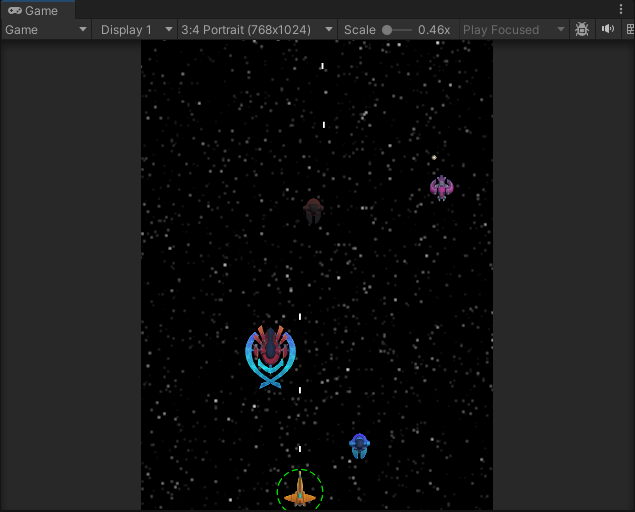
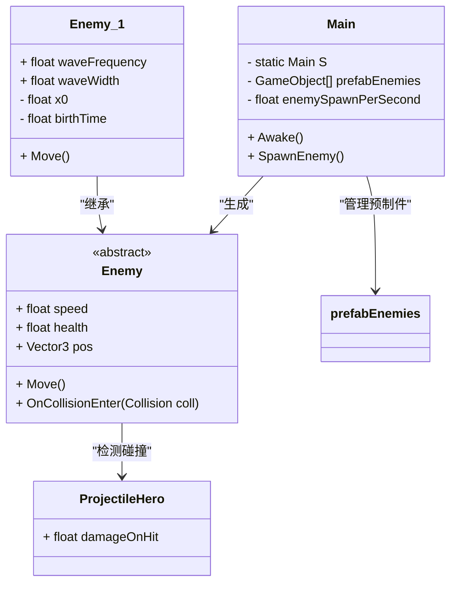
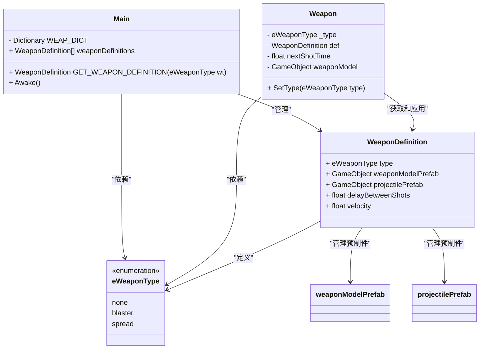
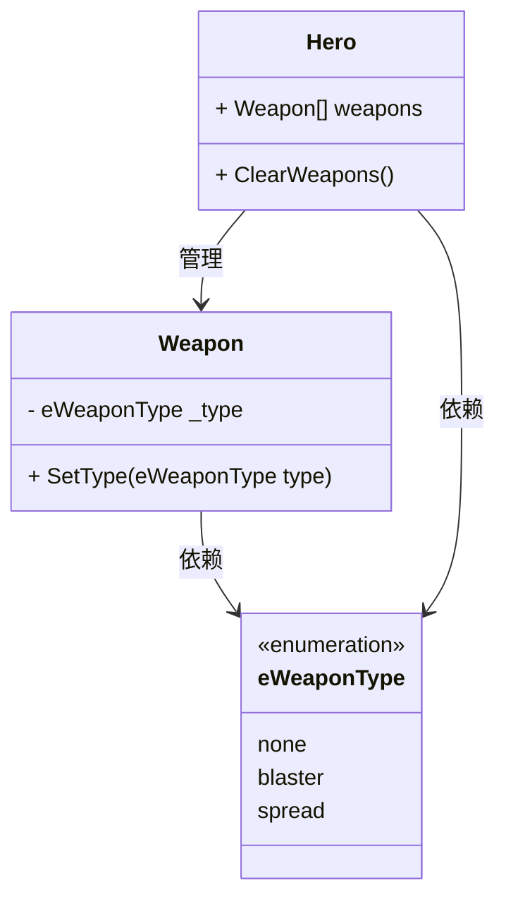
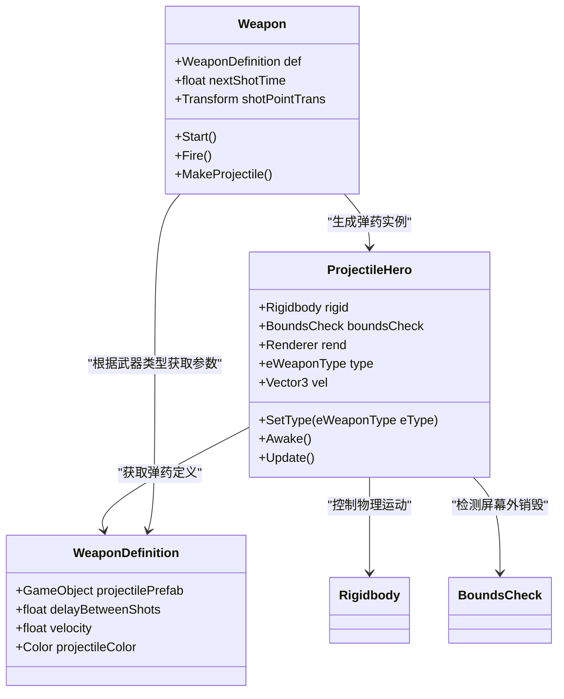
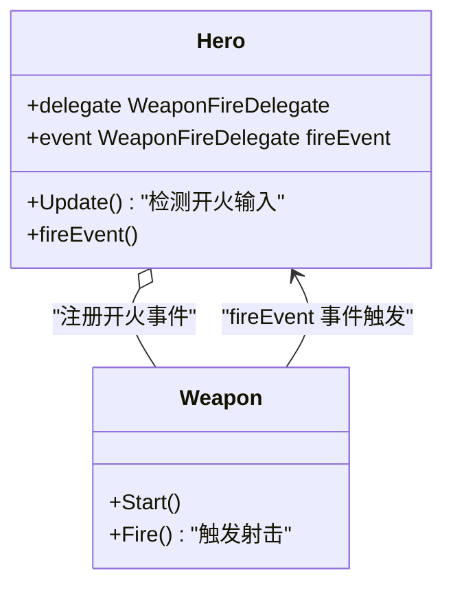
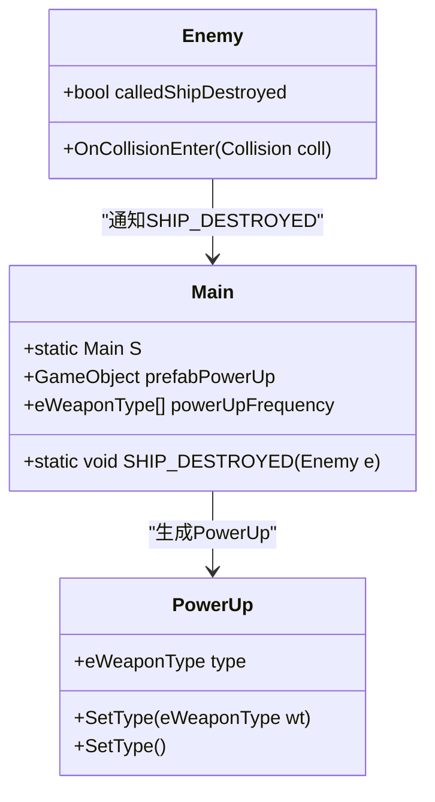
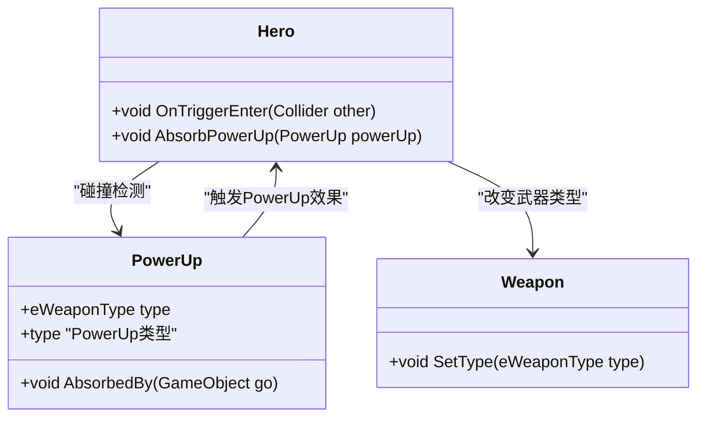

---
title: Space SHMUP 拆解和拓展
mathjax: true
date: 2024-11-19 19:56:54
description: 我在学习 Introduction to Game Design, Prototyping, and Development 过程中做了项目Space SHMUP, 本文记述了我在对该项目的理解, 使用UML对系统进行拆解, 更深刻地体会了游戏的运行过程, 在最后我还对该项目做了一点扩展. 
tags:
--- 

# 游戏内容分析

SHMUP （Shoot 'em up），又称STG，即清版射击游戏, 是一种游戏类型，通常以玩家控制飞行器或角色为基础，目标是消灭敌人并躲避子弹和障碍物。SHMUP游戏通常具有快节奏的动作、丰富的视觉效果和多样化的武器系统。




本项目来自***Introduction to Game Design, Prototyping, and Development*** 的 Space SHMUP. 含有五种敌人角色和两种武器类型, 玩家需要操纵飞船躲避敌人, 攻击敌人, 当击败敌人时可以获得加成道具.

## 玩家角色


### 玩家飞船的意义

1. 当游戏开始时出现在地图中
2. 当玩家飞船被消灭后游戏结束

### 玩家飞船的能力

1. 在地图上移动
2. 控制武器开火

### 玩家飞船与其他对象的交互

1. 碰撞到敌人, 导致自生护盾减少, 当自身无护盾时被消灭
2. 碰撞到加成道具, 导致武器系统发生变化

## 敌人角色


敌人包括五种

### 敌人飞船的意义

1. 根据游戏时间进行, 敌人飞船会随机在地图中生成, 给玩家飞船的生存带来负面影响

    [待扩展]将敌人生成预设为波次进攻模式, 根据关卡难度控制生成情况

### 敌人飞船的能力

1. 在地图中移动, 不同的飞船有各自不同的移动能力
    1. Enemy_0从地图上侧随机处生成, 向地图最下端直线移动, 从下侧离开地图
    2. Enemy_1从地图上侧随机处生成, 向地图最下端移动的同时左右摇摆, 从下侧离开地图
    3. Enemy_2从地图左右侧随机生成, 横向进入地图, 来回穿越一回合后从另一侧离开地图
    4. Enemy_3从地图上侧随机处生成, 纵向进入地图, 抵达路径最低处后从上侧离开地图
    5. Enemy_4从地图上侧随机处生成, 每隔一段时间, 在地图的四个象限没移动, 不会离开地图
2. 掉落武器系统加成道具
3. [可扩展]获得武器并控制武器开火

### 敌人飞船与其他对象的交互

1. 承受玩家武器的攻击(碰撞到子弹), 减少生命值, 当生命值归零时, 自身销毁.
    1. Enemy_4持有护盾, 当收到攻击时, 优先消耗护盾的生命值
2. 碰撞到玩家飞船, 导致自身销毁.

## 武器系统


玩家护盾虽与暂时玩家飞船绑定, 但可改造为武器系统的一部分

### 武器系统的意义

1. 为玩家飞船提供清理敌人飞船的能力, 使得玩家飞船在游戏中生存下来
2. 含有5个武器挂载点位, 为玩家提供了武器的选择和升级空间, 使游戏更加有趣

### 武器系统的能力

1. 当玩家控制开火时, 武器可以以不同形式发射弹药, 而弹药可以攻击并消灭敌人
    1. Blaster 每次开火向正前方发射一枚子弹, 子弹会向前移动直到地图边缘, 发射间隔较短
    2. Spread 每次开火向前方扇形排布发射多枚子弹, , 子弹会向前移动直到地图边缘, 发射间隔较长
    3. [待扩展]Missile 每次开火发射一枚导弹, 导弹可以自动跟踪敌人

### 武器系统与其他对象的交互

1. 武器本身不与敌人交互, 而是通过弹药来与敌人交互, 武器的职责是是生成弹药, 当弹药接触到敌人时, 给敌人造成伤害
2. 武器系统会根据玩家接触到的加成道具进行改变
    1. 玩家最多持有五个武器
    2. 当玩家获得的加成和已持有的武器类型一致时, 武器系统得到强化
    3. 当玩家获得的加成和已持有武器类型不一致时, 将玩家的武器替换为所加成的武器, 此时武器系统可能强化或弱化

## 加成道具


### 加成道具的意义

1. 加成道具可以为玩家提供武器系统的加成选项
2. 加成道具可以让玩家提供一个选择, 是否需要穿越危险的交战区, 去获得加成道具, 使得游戏局面变得复杂有趣

### 加成道具的能力

1. 不同的加成道具可以给玩家提供不同的升级
    1. Shield 增强玩家的护盾
    2. Spread 给玩家添加Spread 武器
    3. Blaster 给玩家添加Blaster 武器
    4. [可扩展] 同步武器系统的武器类型, 提供加成
    5. [可扩展] 对游戏局势产生重大效果, 如对所有敌人造成伤害

### 加成道具与其他对象的交互

1. 与玩家飞船碰撞, 导致自身被消耗, 对玩家飞船造成相应影响
2. 当敌人被消灭时, 根据概率设定, 生成不同的加成道具
3. [可扩展]与敌人飞船碰撞, 导致自身被销毁
4. [可扩展]与敌人飞船碰撞, 对敌人飞船产生影响

# 系统分析与实现

## BoundsCheck

一个通用组件, 用于判断游戏对象是否在屏幕中, 获取相对屏幕的位置.

可以用来管理游戏对象, 包括玩家\敌人\子弹的移动范围限制和移出屏幕后销毁.

使用了复合枚举来保存位置信息.

为每一个游戏对象添加BoundsCheck 组件, 通过调用boundsCheck.isOnScreen()或boundsCheck.LocIs来获取信息.

```csharp
using System.Collections;
using System.Collections.Generic;
using UnityEngine;
public class BoundsCheck : MonoBehaviour {
    [System.Flags]
    public enum eScreenLocs {
        onScreen = 0,
        offRight = 1,
        offLeft = 2,
        offTop = 4,
        offBottom = 8,
    }
    public enum eType { center, inset, outset }
    [Header("Inscribed")]
    public eType boundsType = eType.center;
    public float radius = 1f;
    public bool keepOnScreen = true;

    [Header("Dynamic")]
    public eScreenLocs screenLocs = eScreenLocs.onScreen;
    public float camWidth;
    public float camHeight;

    void LateUpdate() {
        //更新screenLocs 
    }
    public bool isOnScreen {
        get { return screenLocs == eScreenLocs.onScreen; }
    }
    public bool LocIs(eScreenLocs checkLoc) {
        if (checkLoc == eScreenLocs.onScreen) {
            return isOnScreen;
        }
        return (screenLocs & checkLoc) == checkLoc;
    }
}

```

## Enemy



### Enemy生成

Enemy的生成为全局管理, 由游戏唯一Main对象管理, Main为单例, 且保存所有Enemy的预制件.

当Main对象被创建后, 每隔一段时间调用SpawnEnemy()方法, 由SpawnEnemy()生成一个Enemy, 在SpawnEnemy中选取要生成的具体Enemy可以要生成的具体坐标, 然后通过Invoke延时递归调用自身.

```csharp
using System;
using System.Collections;
using System.Collections.Generic;
using UnityEngine;
using UnityEngine.SceneManagement;
using Random = UnityEngine.Random;

public class Main : MonoBehaviour
{
    static private Main S;
    public GameObject[] prefabEnemies;
    public float enemySpawnPerSecond = 0.5f;

    void Awake()
    {
        S = this;
        Invoke(nameof(SpawnEnemy), 1f / enemySpawnPerSecond);
    }

    public void SpawnEnemy()
    {
        // 随机选取一个要生成的Enemy
        int ndx = Random.Range(0, prefabEnemies.Length);
        GameObject newEnemy = Instantiate<GameObject>(prefabEnemies[ndx]);
        // 获取Enemy要生成的坐标
        Vector3 pos = Vector3.zero;
        newEnemy.transform.position = pos;
        // 根据配置生成下一个Enemy
        Invoke(nameof(SpawnEnemy), 1f / enemySpawnPerSecond);
    }
}
```


### Enemy基类和扩展类

Enemy预制件附带有对应的Enemy脚本, 控制对应Enemy的行为.


每一种Enemy的通用属性, 如移动速度, 血量, 可以定义在基类中


每一种Enemy的移动方式不同, 可以再基类中实现基本移动功能, 在具体类中实现扩展功能.

Enemy基类, 实现基本向下移动

```csharp
using System;
using System.Collections;
using System.Collections.Generic;
using UnityEngine;
[RequireComponent(typeof(BoundsCheck))]
public class Enemy : MonoBehaviour {
    [Header("Inscribed")]
    public float speed = 10f;
    public float fireRate = 0.3f;
    public float health = 10;
    public int score = 100;
    public Vector3 pos {
        get {
            return transform.position;
        }
        set {
            transform.position = value;
        }
    }
    void Update() {
        Move();
    }

    public virtual void Move() {
        Vector3 tempPos = pos;
        tempPos.y -= speed * Time.deltaTime;
        pos = tempPos;
    }
}

```

例如: Enemy_1子类, 重写Move方法, 实现带有摆动的移动.

通过Sin函数和存货时间计算摆动横向偏移量, 而基础的向下移动功能, 又由Enemy基类完成.

```csharp
using System.Collections;
using System.Collections.Generic;
using UnityEngine;

public class Enemy_1 : Enemy {
    [Header("Enemy_1 Inscribed Fields")]
    [Tooltip("# of seconds for a full sine wave")]
    public float waveFrequency = 2;
    [Tooltip("Sine wave width in meters")]
    public float waveWidth = 6;
    private float x0;
    private float birthTime;

    void Start() {
        x0 = pos.x;
        birthTime = Time.time;
    }

    public override void Move() {
        Vector3 tempPos = pos;
        float age = Time.time - birthTime;
        float theta = Mathf.PI * 2 * age / waveFrequency;
        float sin = Mathf.Sin(theta);
        tempPos.x = x0 + sin * waveWidth;
        pos = tempPos;
        
        base.Move();
    }
}

```

### Enemy受击处理

Enemy可以和弹药类ProjectileHero进行碰撞, 通过Layer设置是否可以碰撞, 然后在OnCollisionEnter中处理具体碰撞逻辑.

弹药由武器生成, 弹药有伤害数值, 下文另谈.

弹药游戏对象持有ProjectileHero组件, 可用来判断Enemy碰撞到的是否是弹药.

当Enemy碰撞到弹药后, 销毁弹药. 同时扣除自身血量, 血量耗尽后销毁Enemy.

```csharp
using System;
using System.Collections;
using System.Collections.Generic;
using UnityEngine;
[RequireComponent(typeof(BoundsCheck))]
public class Enemy : MonoBehaviour {

    public float health = 10;
    
    void OnCollisionEnter(Collision coll) {
        GameObject otherGO = coll.gameObject;
        ProjectileHero projectileHero = otherGO.GetComponent<ProjectileHero>();
        if (projectileHero != null) {
            if (bndCheck.isOnScreen) {
                health -= Main.GET_WEAPON_DEFINITION(projectileHero.type).damageOnHit;
                if (health < 0) {
                    if (!calledShipDestroyed) {
                        calledShipDestroyed = true;
                        Main.SHIP_DESTROYED(this);
                    }
                    Destroy(gameObject);
                }
            }
            Destroy(otherGO);
        } else {
            Debug.Log("Enemy hit by non-ProjectileHero: " + otherGO.name);
        }
    }
}

```

## Hero

### Hero生成

玩家飞船也为全局唯一对象, 使用单例模式, 使用Hero脚本控制行为.

因为不会重复生成, 所以游戏开始时直接布置在场景Scene中.


### 玩家移动控制

有参数最大速度. 根据帧间时间计算移动后所处位置, 直接改变.

每帧读取移动虚拟轴输入, 实现平滑移动.

```csharp
using System;
using System.Collections;
using System.Collections.Generic;
using UnityEngine;

public class Hero : MonoBehaviour {
    static public Hero S { get; private set; }

    [Header("Inscribed")]
    public float maxSpeed = 30;

    void Awake() {
        if (S == null) {
            S = this;
        } else {
            Debug.LogError("Hero.Awake() - Attempted to assign second Hero.S!");
        }
    }

    void Update() {
        float hAxis = Input.GetAxis("Horizontal");
        float vAxis = Input.GetAxis("Vertical");

        Vector3 pos = transform.position;
        pos.x += hAxis * maxSpeed * Time.deltaTime;
        pos.y += vAxis * maxSpeed * Time.deltaTime;
        transform.position = pos;

    }
}

```

### 玩家开火控制

每帧读取开火虚拟轴输入, 触发开火事件. 具体开火实现见武器系统.

```csharp
using System;
using System.Collections;
using System.Collections.Generic;
using UnityEngine;

public class Hero : MonoBehaviour {
    public delegate void WeaponFireDelegate();
    public event WeaponFireDelegate fireEvent;

    void Update() {
      if (Input.GetAxis("Jump") == 1 && fireEvent != null) {
            fireEven();
        }
    }

}

```

## Weapon

### Weapon配置管理和切换



在本系统中, 武器被实现为一个可以通过类型枚举来配置武器行为的对象. 武器对象是一直存在的, 会根据类型的切换改变表现的形态.

武器的具体参数又保存在具体的武器定义类中. 不仅仅是数值参数, 还有模型预制体参数和子弹预制体参数.

```csharp
// 武器类型的枚举
public enum eWeaponType {
    none,       // 无
    blaster,    // 爆能枪
    spread,     // 散射枪
}

// 武器定义类，描述每种武器的属性
[System.Serializable]
public class WeaponDefinition {
    public eWeaponType type = eWeaponType.none;  // 武器类型，默认无
    [Tooltip("附加到玩家飞船上的武器模型预制件")]  // 提示：武器模型的预制件
    public GameObject weaponModelPrefab;
    [Tooltip("发射的投射物预制件")]  // 提示：发射的投射物的预制件
    public GameObject projectilePrefab;
    [Tooltip("每次射击之间的延迟秒数")]  // 提示：射击间隔时间
    public float delayBetweenShots = 0;
    [Tooltip("单个投射物的速度")]  // 提示：投射物速度
    public float velocity = 50;
}
```

所有的武器定义类被保存在Main对象中, 便于统一修改.

使用一个列表weaponDefinitions来保存所有的武器定义类, 在Unity中进行修改.


然后在Main脚本激活时将weaponDefinitions中的参数保存到字典Dictionary<eWeaponType, WeaponDefinition> WEAP_DICT中, 这样就可以通过GET_WEAPON_DEFINITION()方法, 在具体武器类想要获得具体武器参数是获得在Unity中写好的配置.

```csharp
using System;
using System.Collections;
using System.Collections.Generic;
using UnityEngine;
using UnityEngine.SceneManagement;
using Random = UnityEngine.Random;

[RequireComponent(typeof(BoundsCheck))]
public class Main : MonoBehaviour {
    static private Main S;
    static private Dictionary<eWeaponType, WeaponDefinition> WEAP_DICT;
    public WeaponDefinition[] weaponDefinitions;
    
    void Awake() {
        //单例模式
        S = this;
        bndCheck = GetComponent<BoundsCheck>();
        Invoke(nameof(SpawnEnemy), 1f / enemySpawnPerSecond);
        WEAP_DICT = new Dictionary<eWeaponType, WeaponDefinition>();
        foreach (WeaponDefinition def in weaponDefinitions) { WEAP_DICT[def.type] = def; }
    }

    }
    static public WeaponDefinition GET_WEAPON_DEFINITION(eWeaponType wt) {
        if (WEAP_DICT.ContainsKey(wt)) return WEAP_DICT[wt];
        return new WeaponDefinition();
    }
}

```

通过在具体武器类中保存武器类型定义类eWeaponType _type, 每次修改类型时, 武器对象通过Main.GET_WEAPON_DEFINITION(_type); 方法更新武器的定义, 从而加载不同的模型, 以及获取一些武器参数.

```csharp
// 武器类
public class Weapon : MonoBehaviour {
    private eWeaponType _type = eWeaponType.none;  // 当前武器类型，默认无
    public WeaponDefinition def;   // 武器定义
    private GameObject weaponModel; // 武器模型

    void Start() {
        SetType(_type);  // 设置武器类型

    }

    // 武器类型的属性
    public eWeaponType type {
        get { return _type; }
        set { SetType(value); }
    }

    // 设置武器类型
    public void SetType(eWeaponType type) {
        _type = type;

        def = Main.GET_WEAPON_DEFINITION(_type);  // 获取武器的定义

        // 如果已有武器模型，销毁它
        if (weaponModel != null) Destroy(weaponModel);
        // 实例化新的武器模型
        weaponModel = Instantiate<GameObject>(def.weaponModelPrefab, transform);
        weaponModel.transform.localPosition = Vector3.zero;
        weaponModel.transform.localScale = Vector3.one;

    }
}
```

图示

### Weapon对象载入



武器的实际挂载对象是玩家飞船, 通过Hero脚本进行管理.

在游戏场景的Hero游戏对象上, 有五个子游戏对象hardpoint, 每个绑定在玩家飞船的不同位置上, 然后在游戏对象hardpoint上有子游戏对象Weapon预制件实例, Weapon脚本作为Weapon预制件的组件, Hero脚本作为Hero游戏对象的组件. 在Hero脚本中有Weapon列表, 绑定这些Weapon预制件实例来进行管理.

通过调用Weapon.SetType(eWeaponType), 就可以设置具体的Weapon预制件实例的类型.

ClearWeapons()方法可以将所有的Weapon预制件实例类型改为eWeaponType.none.

```csharp
using System;
using System.Collections;
using System.Collections.Generic;
using UnityEngine;

public class Hero : MonoBehaviour {
    static public Hero S { get; private set; }
    public Weapon[] weapons;

    void Awake() {
        if (S == null) {
            S = this;
        } else {
            Debug.LogError("Hero.Awake() - Attempted to assign second Hero.S!");
        }
        ClearWeapons();
        weapons[0].SetType(eWeaponType.blaster);
    }
    public void ClearWeapons() {
        foreach (Weapon w in weapons) {
            w.SetType(eWeaponType.none);
        }
    }

}

```

### Weapon开火



对于每一个Weapon游戏对象实例, 由Weapon预制体的子对象ShotPoint提供射击点, 也就是弹药生成的位置.

Weapon 脚本通过WeaponDefinition def上保存的武器定义, 来获取弹药的参数, 包括弹药预制体和弹药速度等.

Fire()方法作为Weapon的开火方法, 当被触发时, 根据保存的武器类型, 进行相对应的弹药生成方法. 例如blaster就生成一个弹药, spread就生成三个弹药. 弹药

```csharp
// 武器类
public class Weapon : MonoBehaviour {
    public WeaponDefinition def;   // 武器定义
    public float nextShotTime;     // 下一次射击的时间
    private Transform shotPointTrans; // 射击点的Transform
    
  void Start() {
        shotPointTrans = transform.GetChild(0);  // 获取子物体的Transform作为射击点
    }
    
    // 触发射击
    private void Fire() {
        if (Time.time < nextShotTime) return;  // 如果还没到下一次射击时间，返回

        ProjectileHero projectileHero;  // 投射物
        Vector3 vel = Vector3.up * def.velocity;  // 投射物速度

        // 根据武器类型发射不同的投射物
        switch (type) {
            case eWeaponType.blaster:  // 爆能枪
                projectileHero = MakeProjectile();  // 创建投射物
                projectileHero.vel = vel;  // 设置投射物速度
                break;
            case eWeaponType.spread:  // 散射武器
                projectileHero = MakeProjectile();
                projectileHero.vel = vel;

                // 创建左侧散射投射物
                projectileHero = MakeProjectile();
                projectileHero.transform.rotation = Quaternion.AngleAxis(10, Vector3.back);
                projectileHero.vel = projectileHero.transform.rotation * vel;

                // 创建右侧散射投射物
                projectileHero = MakeProjectile();
                projectileHero.transform.rotation = Quaternion.AngleAxis(-10, Vector3.back);
                projectileHero.vel = projectileHero.transform.rotation * vel;

                break;
        }
    }

    // 创建投射物实例
    private ProjectileHero MakeProjectile() {
        GameObject gameObject = Instantiate<GameObject>(def.projectilePrefab, PROJECTILE_ANCHOR);  // 实例化投射物
        ProjectileHero projectileHero = gameObject.GetComponent<ProjectileHero>();  // 获取投射物组件

        Vector3 pos = shotPointTrans.position;  // 获取射击点的位置
        pos.z = 0;  // 设置Z轴为0
        projectileHero.transform.position = pos;  // 设置投射物位置

        projectileHero.type = type;  // 设置投射物类型
        nextShotTime = Time.time + def.delayBetweenShots;  // 设置下一次射击的时间
        return projectileHero;  // 返回投射物实例
    }
}

```

弹药ProjectileHero 实例由Weapon生成,

由Weapon控制其速度, 由刚体组件控制其运动,

由BoundsCheck组件提供是否飞出屏幕, 判断销毁,

由Enemy判断碰撞逻辑销毁.

```csharp
using System;
using System.Collections;
using System.Collections.Generic;
using UnityEngine;
[RequireComponent(typeof(BoundsCheck))]
public class ProjectileHero : MonoBehaviour {
    private BoundsCheck boundsCheck;
    private Renderer rend;
    [Header("Dynamic")]
    public Rigidbody rigid;
    private eWeaponType _type;
    public eWeaponType type {
        get { return _type; }
        set { SetType(value); }
    }
    
    public void SetType(eWeaponType eType) {
        _type = eType;
        WeaponDefinition def = Main.GET_WEAPON_DEFINITION(_type);
        rend.material.color = def.projectileColor;
    }
    public Vector3 vel {
        get { return rigid.velocity; }
        set { rigid.velocity = value; }
    }

    void Awake() {
        boundsCheck = GetComponent<BoundsCheck>();
        rend = GetComponent<Renderer>();
        rigid = GetComponent<Rigidbody>();
    }

    void Update() {
        if (boundsCheck.LocIs(BoundsCheck.eScreenLocs.offTop)) {
            Destroy(gameObject);
        }
    }
}

```

### Hero开火事件



Weapon的开火事件由Hero控制触发.

在Hero上保存有委托fireEvent, 每帧检测是否有开火控制型号, 然后触发fireEvent.

```csharp
using System;
using System.Collections;
using System.Collections.Generic;
using UnityEngine;

public class Hero : MonoBehaviour {
    static public Hero S { get; private set; }

    public delegate void WeaponFireDelegate();
    public event WeaponFireDelegate fireEvent;

    void Update() {
        if (Input.GetAxis("Jump") == 1 && fireEvent != null) {
            fireEvent();
        }
    }

}

```

在Weapon上注册事件, 将Weapon的Fire方法绑定到Hero的fireEvent上.

这样当Hero触发开火时, 所有的Weapon都会开火.

```csharp
// 武器类
public class Weapon : MonoBehaviour {

    void Start() {
      // 如果该武器附加在玩家上，注册射击事件
        Hero hero = GetComponentInParent<Hero>();
        if (hero != null) hero.fireEvent += Fire;
    }
    
    // 触发射击
    private void Fire() {
    
    }

}

```

## PowerUp

升级道具由Enemy死亡掉落, 可以触发Weapon改变

### PowerUp生成



PowerUp有其类型, 对应武器类型.

```csharp
public class PowerUp : MonoBehaviour {

    [Header("Dynamic")]
    public eWeaponType _type;          // PowerUp 的类型
    public float birthTime;     // PowerUp 实例化时的 Time.time

    void Awake() {
    
        birthTime = Time.time; // 记录实例化时的时间
    }

    // PowerUp 类型的属性
    public eWeaponType type { get { return _type; } set { SetType(value); } } // h

    // 设置 PowerUp 类型
    public void SetType(eWeaponType wt) {
        // 从 Main 中获取武器定义
        WeaponDefinition def = Main.GET_WEAPON_DEFINITION(wt);
        cubeMat.color = def.powerUpColor;  // 设置 PowerCube 的颜色
        letter.text = def.letter;          // 设置显示的字母
        _type = wt;                         // 最终设置类型
    }

}

```

为了使系统保持简洁, 也就是可以生成实例的类不要太多, 这里吧生成PowerUP的职责放在Main中.

当Enemy被销毁时, 通知Main.  使用Main.SHIP_DESTROYED(this);

```csharp
public class Enemy : MonoBehaviour {

    void OnCollisionEnter(Collision coll) {
        GameObject otherGO = coll.gameObject;
        ProjectileHero projectileHero = otherGO.GetComponent<ProjectileHero>();
        if (projectileHero != null) {
            if (bndCheck.isOnScreen) {
                health -= Main.GET_WEAPON_DEFINITION(projectileHero.type).damageOnHit;
                if (health < 0) {
                    if (!calledShipDestroyed) {
                        calledShipDestroyed = true;
                        Main.SHIP_DESTROYED(this);
                    }
                    Destroy(gameObject);
                }
            }
            Destroy(otherGO);
        } else {
            Debug.Log("Enemy hit by non-ProjectileHero: " + otherGO.name);
        }
    }
}

```

Main中保存有PowerUP预制体, 以及一个eWeaponType列表, 用来控制PowerUP生成类型的概率.

当Main.SHIP_DESTROYED被触发时, 生成PowerUP并设定类型.

```csharp
using Random = UnityEngine.Random;

public class Main : MonoBehaviour {
    static private Main S;
    
    public GameObject prefabPowerUp;
    public eWeaponType[] powerUpFrequency = new eWeaponType[]{
        eWeaponType.blaster,
        eWeaponType.blaster,
        eWeaponType.spread,
        eWeaponType.shield,
    };
    
    static public void SHIP_DESTROYED(Enemy e) {
        // 有可能生成一个PowerUp
        if (Random.value <= e.powerUpDropChance) {  // 有一定几率生成 PowerUp
            // 从powerUpFrequency数组中选择一个PowerUp类型
            eWeaponType pUpType = S.powerUpFrequency[Random.Range(0, S.powerUpFrequency.Length)];  // 选择 PowerUp 类型

            // 生成一个PowerUp对象
            GameObject go = Instantiate<GameObject>(S.prefabPowerUp);  // 实例化 PowerUp 对象
            PowerUp pUp = go.GetComponent<PowerUp>();  // 获取 PowerUp 脚本组件
            // 设置生成的PowerUp为选定的武器类型
            pUp.SetType(pUpType);  // 设置 PowerUp 的类型

            // 设置 PowerUp 的位置为被摧毁的飞船的位置
            pUp.transform.position = e.transform.position;
        }
    }

}

```

### PowerUp触发



当PowerUP被Hero碰撞后, 被消化使用. 在Hero中判断powerUp.type, 根据具体类型产生不同效果, 同时销毁powerUp.

若powerUp.type为一种武器, 触发weapon.SetType(powerUp.type), 到Weapon类型被改变.

```csharp
using System;
using System.Collections;
using System.Collections.Generic;
using UnityEngine;

public class Hero : MonoBehaviour {
    static public Hero S { get; private set; }
    private GameObject lastTriggerGo = null;

    void OnTriggerEnter(Collider other) {
        Transform rootT = other.gameObject.transform.root;
        GameObject gameObject = rootT.gameObject;
        if (gameObject == lastTriggerGo) return;
        lastTriggerGo = gameObject;

        Enemy enemy = gameObject.GetComponent<Enemy>();
        PowerUp powerUp = gameObject.GetComponent<PowerUp>();

        if (enemy != null) {
            shieldLevel--;
            Destroy(gameObject);
        } else if (powerUp != null) {
            AbsorbPowerUp(powerUp);
        } else {
            Debug.LogWarning("Shield trigger hit by non-Enemy: " + gameObject.name);
        }

    }

    public void AbsorbPowerUp(PowerUp powerUp) {
        Debug.Log("Absorbed PowerUp: " + powerUp.type);
        switch (powerUp.type) {
            case eWeaponType.shield:
                shieldLevel++;
                break;
            default:
                if (powerUp.type == weapons[0].type) {
                    Weapon weapon = GetEmptyWeaponSlot();
                    if (weapon != null) {
                        weapon.SetType(powerUp.type);
                    }
                } else {
                    ClearWeapons();
                    weapons[0].SetType(powerUp.type);
                }
                break;
        }
        powerUp.AbsorbedBy(gameObject);
    }

}

```

当PowerUP被触发时, 销毁自己

```csharp
public class PowerUp : MonoBehaviour {
    public void AbsorbedBy(GameObject target) {
        Destroy(this.gameObject);
    }

}

```

# 视觉效果

## 飞船运动倾角

### Hero中的应用

移动时, 根据虚拟轴输入, 计算旋转角度


```csharp
using System;
using System.Collections;
using System.Collections.Generic;
using UnityEngine;

public class Hero : MonoBehaviour {
    static public Hero S { get; private set; }

    [Header("Inscribed")]
    public float maxSpeed = 30;
    public float rollMult = -45;
    public float pitchMult = 30;

    void Update() {
        float hAxis = Input.GetAxis("Horizontal");
        float vAxis = Input.GetAxis("Vertical");

        transform.rotation = Quaternion.Euler(vAxis * pitchMult, hAxis * rollMult, 0);

    }
}

```

### Enemy_1中的应用

移动时, 根据侧向偏移量, 计算旋转角度


```csharp
using System.Collections;
using System.Collections.Generic;
using UnityEngine;

public class Enemy_1 : Enemy {
    [Header("Enemy_1 Inscribed Fields")]
    [Tooltip("# of seconds for a full sine wave")]
    public float waveFrequency = 2;
    [Tooltip("Sine wave width in meters")]
    public float waveWidth = 6;
    [Tooltip("Amount the ship will roll left and right with the sine wave")]
    public float waveRotY = 45;
    private float x0;
    private float birthTime;

    void Start() {
        x0 = pos.x;
        birthTime = Time.time;
    }

    public override void Move() {
        Vector3 tempPos = pos;
        float age = Time.time - birthTime;
        float theta = Mathf.PI * 2 * age / waveFrequency;
        float sin = Mathf.Sin(theta);
        tempPos.x = x0 + sin * waveWidth;
        pos = tempPos;

        Vector3 rot = new Vector3(0, sin * waveRotY, 0);
        transform.rotation = Quaternion.Euler(rot);

        base.Move();

        // print(bndCheck.isOnScreen);
    }
}

```

### Enemy_2中的应用

移动时, 根据AnimationCurve 曲线, 计算旋转角度


```csharp
using System.Collections;
using System.Collections.Generic;
using UnityEngine;

public class Enemy_2 : Enemy {
    [Header("Enemy_2 Inscribed Field")]
    public float lifeTime = 10f;

    [Tooltip("波幅控制")]
    public float sinEccentricity = 0.6f;
    public AnimationCurve rotCurve;

    [Header("Enemy_2 Private Fields")]
    [SerializeField] private float birthTime;
    private Quaternion baseRotation;
    [SerializeField] private Vector3 p0, p1;//插值控制点

    void Start() {
        p0 = Vector3.zero;
        p0.x = -bndCheck.camWidth - bndCheck.radius;
        p0.y = Random.Range(-bndCheck.camHeight, bndCheck.camHeight);

        p1 = Vector3.zero;
        p1.x = bndCheck.camWidth + bndCheck.radius;
        p1.y = Random.Range(-bndCheck.camHeight, bndCheck.camHeight);

        if (Random.value > 0.5f) {
            p0.x *= -1;
            p1.x *= -1;
        }

        birthTime = Time.time;

        transform.position = p0;
        transform.LookAt(p1, Vector3.back);
        baseRotation = transform.rotation;
    }

    public override void Move() {
        float u = (Time.time - birthTime) / birthTime;

        if (u > 1) {
            Destroy(gameObject);
            return;
        }

        float shipRot = rotCurve.Evaluate(u) * 360;
        transform.rotation = baseRotation * Quaternion.Euler(-shipRot, 0, 0);

        u = u + sinEccentricity * Mathf.Sin(u * Mathf.PI * 2);

        pos = (1 - u) * p0 + u * p1;

    }
}

```

## 平滑移动路径

### 贝塞尔曲线

```csharp
using System.Linq;
using UnityEngine;

public class Utils : MonoBehaviour {
    /// <summary>
    /// 递归计算任意数量控制点的 Bézier 曲线上的点
    /// </summary>
    /// <param name="t">插值比例 [0..1]</param>
    /// <param name="points">控制点数组</param>
    /// <returns>曲线上的插值点</returns>
    static public Vector3 Bezier(float t, params Vector3[] points) {
        // 当只有一个控制点时，返回该控制点
        if (points.Length == 1) return points[0];

        // 使用 LINQ 的 Select 和 Zip 进行插值计算
        return Bezier(t, points.Take(points.Length - 1)
                               .Zip(points.Skip(1), (p0, p1) => Vector3.LerpUnclamped(p0, p1, t))
                               .ToArray());
    }

}

```

### Enemy_3中的应用


```csharp
using System.Collections;
using System.Collections.Generic;
using UnityEngine;

public class Enemy_3 : Enemy {            // Enemy_3 继承自 Enemy 类
    [Header("Enemy_3 公共字段")]
    public float lifeTime = 5;            // 生命时长为5秒
    public Vector2 midpointYRange = new Vector2(1.5f, 3);   // 中间点Y轴范围
    [Tooltip("如果为true,则在Scene面板中绘制Bézier点和路径。")]
    public bool drawDebugInfo = true;     // 是否绘制调试信息

    [Header("Enemy_3 私有字段")]
    [SerializeField]
    private Vector3[] points;  // Bézier曲线的三个点
    [SerializeField]
    private float birthTime;   // 记录生成时间

    // Start方法,因父类Enemy未使用,所以可以在此处使用
    void Start() {
        points = new Vector3[3];  // 初始化三个控制点

        // 起始位置已经由 Main.SpawnEnemy() 设置
        points[0] = pos;  // 第一个点是当前敌人的初始位置

        // 设置x轴的最小和最大值,和Main.SpawnEnemy()方式一致
        float xMin = -bndCheck.camWidth + bndCheck.radius;
        float xMax = bndCheck.camWidth - bndCheck.radius;

        // 随机选择屏幕下半部分的一个中间点
        points[1] = Vector3.zero;  // 初始化第二个点
        points[1].x = Random.Range(xMin, xMax);  // x轴随机范围
        float midYMult = Random.Range(midpointYRange[0], midpointYRange[1]);  // 随机Y轴比例  // a
        points[1].y = -bndCheck.camHeight * midYMult;  // 设置Y轴位置  // a

        // 随机选择屏幕上方的一个最终点
        points[2] = Vector3.zero;  // 初始化第三个点
        points[2].y = pos.y;       // Y轴保持在初始位置上方
        points[2].x = Random.Range(xMin, xMax);  // x轴随机范围

        // 设置出生时间为当前时间
        birthTime = Time.time;

        // 如果需要绘制调试信息,则调用DrawDebug方法  // b
        if (drawDebugInfo) DrawDebug();
    }

    public override void Move() {
        // Bézier曲线基于u值,u的范围在0到1之间
        float u = (Time.time - birthTime) / lifeTime;

        if (u > 1) {
            // 如果u超过1,表示该敌人生命周期已结束
            Destroy(this.gameObject);  // 销毁游戏对象
            return;
        }

        // 根据u值旋转对象  // c
        transform.rotation = Quaternion.Euler(u * 180, 0, 0);

        // 插值计算Bézier曲线上的三个点  // d
        u = u - 0.1f * Mathf.Sin(u * Mathf.PI * 2);
        pos = Utils.Bezier(u, points);

        // Enemy_3 不调用父类的Move()
    }

    // 绘制调试信息,包括Bézier曲线和控制点  // e
    void DrawDebug() {
        // 绘制三个控制点之间的直线
        Debug.DrawLine(points[0], points[1], Color.cyan, lifeTime);  // 绘制第1到第2个点的线  // f
        Debug.DrawLine(points[1], points[2], Color.yellow, lifeTime); // 绘制第2到第3个点的线

        // 绘制Bézier曲线
        float numSections = 20;  // 曲线分为20段
        Vector3 prevPoint = points[0];  // 上一个点,初始化为第一个控制点  // g
        Color col;
        Vector3 pt;
        for (int i = 1; i < numSections; i++) {  // 绘制Bézier曲线的各段  // h
            float u = i / numSections;  // u的值在0到1之间变化
            pt = Utils.Bezier(u, points);  // 计算当前插值点
            col = Color.Lerp(Color.cyan, Color.yellow, u);  // 根据u值插值颜色
            Debug.DrawLine(prevPoint, pt, col, lifeTime);  // 绘制前一个点到当前点的线  // i
            prevPoint = pt;  // 更新上一个点为当前点
        }
    }
}

```

## 敌人受击反馈

新建受击组件

保存所有子对象材质

检测碰撞, 当被子弹命中时改变材质, 产生效果.

效果根据时间消失.


```csharp
using System.Collections;
using System.Collections.Generic;
using System.Linq;
using UnityEngine;

[DisallowMultipleComponent]  // 不允许在同一个GameObject上添加多个该组件  // a
public class BlinkColorOnHit : MonoBehaviour {
    private static float blinkDuration = 0.1f;  // 闪烁颜色的持续时间（以秒为单位）  // b
    private static Color blinkColor = Color.red;  // 受击时显示的颜色

    [Header("动态参数")]  // 在Inspector面板中分类显示动态参数
    public bool showingColor = false;  // 是否正在显示闪烁颜色
    public float blinkCompleteTime;    // 恢复原始颜色的时间
    public bool ignoreOnCollisionEnter = false;

    private Material[] materials;      // 当前GameObject及其子对象的所有材质
    private Color[] originalColors;    // 材质的原始颜色数组
    private BoundsCheck bndCheck;      // 用于检测对象是否在屏幕范围内的组件

    void Awake() {
        bndCheck = GetComponentInParent<BoundsCheck>();  // 获取父对象上的BoundsCheck组件  // c
        // 获取该GameObject及其所有子对象的材质
        materials = Utils.GetAllMaterials(gameObject);    // d
        // 存储每个材质的原始颜色
        originalColors = materials.Select(m => m.color).ToArray();
    }

    void Update() {
        // 如果正在显示闪烁颜色且当前时间超过了恢复颜色的时间，恢复原始颜色
        if (showingColor && Time.time > blinkCompleteTime) RevertColors();  // e
    }

    void OnCollisionEnter(Collision coll) {
        if (ignoreOnCollisionEnter) return;
        // 如果有BoundsCheck且对象不在屏幕内，跳过受击显示
        if (bndCheck != null && !bndCheck.isOnScreen) {  // g
            return;  // 当对象不在屏幕内时，不显示受击效果
        }
        // 检测与ProjectileHero的碰撞
        ProjectileHero p = coll.gameObject.GetComponent<ProjectileHero>();
        if (p != null) {  // 如果碰撞对象是ProjectileHero  // f

            SetColors();  // 显示受击颜色
        }
    }

    /// <summary>
    /// 将所有材质的主颜色设置为闪烁颜色，并设置显示颜色的时间
    /// </summary>
    public void SetColors() {
        foreach (Material m in materials) {
            m.color = blinkColor;  // 将材质颜色设置为闪烁颜色
        }
        showingColor = true;  // 标记正在显示颜色
        blinkCompleteTime = Time.time + blinkDuration;  // 设置颜色恢复的时间
    }

    /// <summary>
    /// 恢复所有材质的原始颜色，并停止显示颜色
    /// </summary>
    public void RevertColors() {
        for (int i = 0; i < materials.Length; i++) {
            materials[i].color = originalColors[i];  // 恢复原始颜色
        }
        showingColor = false;  // 标记颜色显示结束
    }
}

```

## 无缝太空背景

滚动数组思想.

使用两块背景, 循环播放, 当一张移出屏幕后, 接替到另一张上面.


```csharp
using System.Collections;
using System.Collections.Generic;
using UnityEngine;

public class Parallax : MonoBehaviour {
    [Header("Inscribed")]
    public Transform playerTrans; // The player ship (玩家飞船)
    public Transform[] panels; // The scrolling foregrounds (滚动的前景面板)
    [Tooltip("Speed at which the panels move in Y")]
    public float scrollSpeed = -30f; // 面板在Y轴上的滚动速度
    [Tooltip("Controls how much panels react to player movement (Default 0.25)")]
    public float motionMult = 0.25f; // 控制面板对玩家移动的反应程度 (默认值 0.25)   // a

    private float panelHt; // Height of each panel (每个面板的高度)
    private float depth;   // Depth of panels (that is, pos.z) (面板的深度，即z轴位置)

    void Start() {
        panelHt = panels[0].localScale.y; // 获取第一个面板的高度
        depth = panels[0].position.z; // 获取面板的深度（z轴位置）

        // Set initial positions of panels (设置面板的初始位置)
        panels[0].position = new Vector3(0, 0, depth); // 第一个面板位于起点
        panels[1].position = new Vector3(0, panelHt, depth); // 第二个面板位于第一个面板上方
    }

    void Update() {
        float tY, tX = 0; // 定义用于计算面板位置的变量
        tY = Time.time * scrollSpeed % panelHt + (panelHt * 0.5f); // 随时间滚动并保证循环衔接   // b

        if (playerTrans != null) {
            tX = -playerTrans.transform.position.x * motionMult; // 根据玩家的x位置调整tX   // c
                                                                 // tY += -poi.transform.position.y * motionMult; // 如果需要，也可以对Y轴进行调整
        }

        // Position panels[0] (设置第一个面板的位置)
        panels[0].position = new Vector3(tX, tY, depth);
        // Position panels[1] where needed to make a continuous starfield (根据需要设置第二个面板的位置，以实现连续的星空效果)  // d
        if (tY >= 0) {
            panels[1].position = new Vector3(tX, tY - panelHt, depth); // 第二个面板在第一个面板的上方
        } else {
            panels[1].position = new Vector3(tX, tY + panelHt, depth); // 第二个面板在第一个面板的下方
        }
    }
}

```

# 扩展实践

## Missile

创建一种新的武器-导弹. 可以在发射后自动跟踪敌人.

### 创建新的武器配置

在Main.cs→WeaponDefinitions中创建Missile


在Main.cs→PowerUPfrequency中创建Missile


此时运行游戏

敌人可掉落M道具


拾取后也可正常装备


但此时还没有发射功能

### 添加发射功能

修改Weapon类, 在射击方法中添加处理导弹类型的代码

```csharp

// 武器类
public class Weapon : MonoBehaviour {
    // 触发射击
    private void Fire() {
        // 根据武器类型发射不同的投射物
        switch (type) {
            // 导弹类型
            case eWeaponType.missile:
                projectileHero = MakeProjectile();
                projectileHero.vel = vel;
                break;
        }
    }

}

```

此时可以发生导弹类型的弹药, 由上一步配置为红色.


### 实现目标检测

实现思路

给ProjectileHero创建一个球形碰撞箱来检测敌人

通过向量差值获得指向敌人的向量来修改导弹的速度使其朝向敌人

ProjectileHero已经自身持有一个碰撞箱用来检测是否与敌人碰撞, 所以我们给Missile类型的ProjectileHero创建一个子对象detectionRange, 再在这个子对象detectionRange上添加SphereCollider.

在ProjectileHero上新增代码

```csharp
using System;
using System.Collections;
using System.Collections.Generic;
using UnityEngine;
[RequireComponent(typeof(BoundsCheck))]
public class ProjectileHero : MonoBehaviour {

    private Transform detectionRangeTrans;

    public void SetType(eWeaponType eType) {
    
        // 如果类型是导弹类型，添加检测范围
        if (_type == eWeaponType.missile) {
            AddDetectionRange();
        }
    }

    // 添加用于检测目标的球形碰撞体
    private void AddDetectionRange() {
        // 创建子对象
        GameObject detectionRange = new GameObject("DetectionRange");
        detectionRangeTrans = detectionRange.transform;
        // 设置为ProjectileHero的子对象
        detectionRangeTrans.SetParent(this.transform);
        // 确保位置和ProjectileHero一致
        detectionRangeTrans.localPosition = Vector3.zero;
        // 设置与ProjectileHero相同的Layer
        detectionRangeTrans.gameObject.layer = gameObject.layer;
        // 添加球形碰撞箱
        SphereCollider sphereCollider = detectionRange.AddComponent<SphereCollider>();
        sphereCollider.isTrigger = true; // 设置为触发器
        // 设置碰撞体的半径，决定探测范围
        sphereCollider.radius = 10f; // 可以根据需要调整半径的大小
    }
}

```

实现效果, 可见碰撞箱半径


### 实现目标追踪

为刚才创建的对象添加一个脚本, 专门用来处理追踪逻辑

```csharp
using System;
using System.Collections;
using System.Collections.Generic;
using UnityEngine;
[RequireComponent(typeof(BoundsCheck))]
public class ProjectileHero : MonoBehaviour {
    // 添加用于检测目标的球形碰撞体
    private void AddDetectionRange() {
        // 添加一个额外的脚本，用于处理目标检测逻辑
        detectionRange.AddComponent<MissileTargetDetector>();
    }
}

```

保存变量projectileHero, 用于修改其运动

保存变量enemy 用于确认目标

在OnTriggerEnter中设定目标

在OnTriggerExit中放弃目标

在Update使用线性插值修改速度方向追踪目标

```csharp
using System.Collections;
using System.Collections.Generic;
using UnityEngine;

public class MissileTargetDetector : MonoBehaviour {
    ProjectileHero projectileHero;
    Enemy enemy = null;

    void Awake() {
        projectileHero = gameObject.GetComponentInParent<ProjectileHero>();
    }

    void Update() {
        // 若目标存在且存活, 修正速度方向, 实现追踪功能
        if (enemy != null && enemy.gameObject != null) {
            Vector3 origin = projectileHero.rigid.velocity;
            Vector3 direction = (enemy.transform.position - transform.position).normalized * origin.magnitude;
            projectileHero.rigid.velocity = Vector3.Lerp(origin, direction, 0.2f);
        } else {
            enemy = null;
        }
    }

    void OnTriggerEnter(Collider other) {
        // Debug.LogWarning("Missile trigger Enter: " + other.name);
        // 若敌人进入范围, 且当前无其他目标, 将该敌人设定为目标
        Enemy detectedEnemy = other.gameObject.GetComponent<Enemy>();
        if (enemy == null && detectedEnemy != null) {
            enemy = detectedEnemy;
        }
    }

    void OnTriggerExit(Collider other) {
        // Debug.LogWarning("Missile trigger Exit: " + other.name);
        // 若目标存在且脱离追踪范围, 放弃这个目标
        if (enemy != null && other.gameObject == enemy.gameObject) {
            enemy = null;
        }
    }
}

```

实现效果, 当导弹靠近目标之后, 会指向目标


发现Bug1, 当导弹跟踪的目标丢失以后会失去速度滞留在地图上


修复: 使用线性插值直接修改速度会改变速度大小, 下文优化追踪方案

发现Bug2, 导弹对Enemy_1没有追踪作用

修复: Enemy_1没有碰撞箱, 添加碰撞箱后功能恢复


### 优化目标追踪

将原本的线性插值改变速度方向, 改为旋转导弹的方向, 更加平滑, 视觉表现也更好.

```csharp
using System.Collections;
using System.Collections.Generic;
using UnityEngine;

public class MissileTargetDetector : MonoBehaviour {
    public float rotationSpeed = 4.0f;  // 控制旋转速度
    void Update() {
        // 若目标存在且存活, 修正速度方向, 实现追踪功能
        if (enemy != null && enemy.gameObject != null) {
            // 计算导弹当前朝向与目标之间的旋转
            Vector3 targetDirection = (enemy.transform.position - projectileHero.transform.position).normalized;
            Quaternion targetRotation = Quaternion.LookRotation(Vector3.forward, targetDirection);
            // 平滑地插值旋转到目标方向
            projectileHero.transform.rotation = Quaternion.Slerp(
                projectileHero.transform.rotation,
                targetRotation,
                Time.deltaTime * rotationSpeed
            );
            // 根据当前朝向更新导弹的速度
            projectileHero.vel = projectileHero.transform.up * projectileHero.speed;
        } else {
            enemy = null;
        }
    }
}

```

同时在ProjectileHero保存速度的大小, 修复了导弹静止的问题.

```csharp

public class ProjectileHero : MonoBehaviour {
    public float speed;
    public void SetType(eWeaponType eType) {
        speed = def.velocity;
    }
}

```


